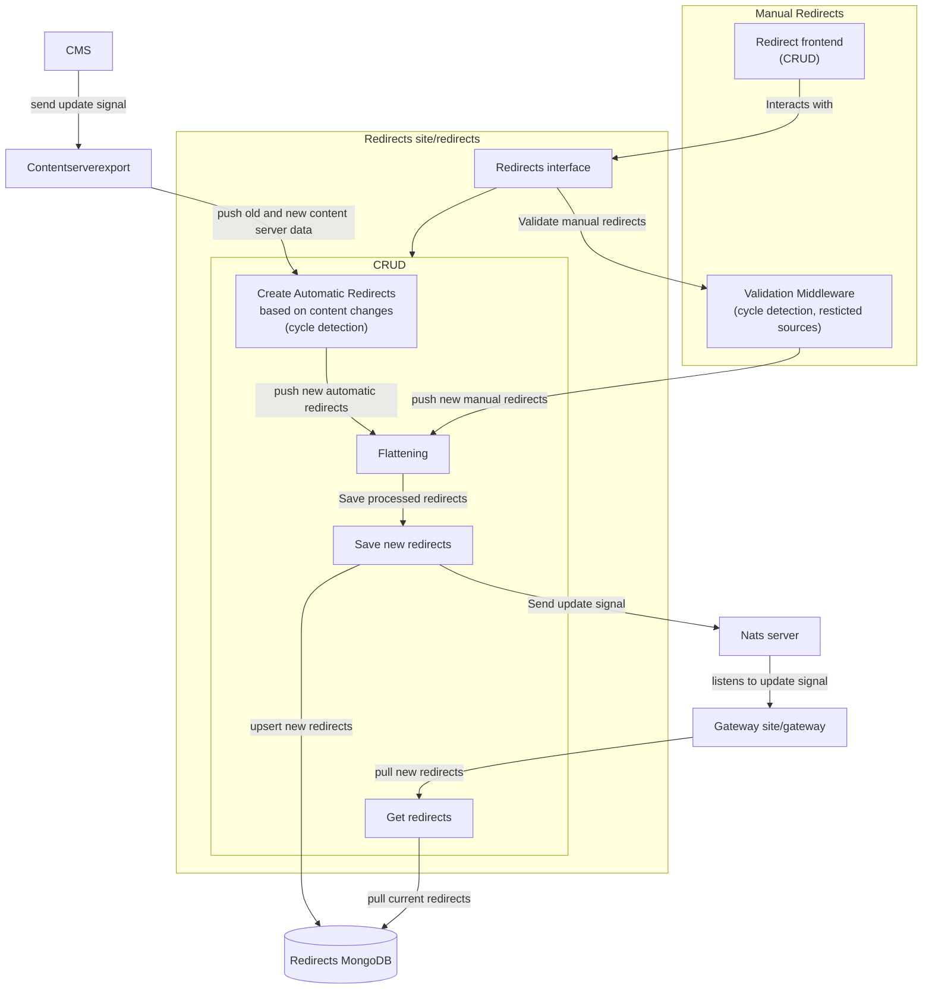

# Redirects

## Introduction and Goals

The **Redirects** framework provides a system for managing URL redirects, supporting both **automatic redirects** (generated from content updates) and **manual redirects** (created via the frontend widget). It ensures efficient redirect handling through **cycle detection** and **flattening**, avoiding infinite loops and redundant redirects.

## Features

- **Automatic Redirects:** Created dynamically based on content updates with **cycle detection**.
- **Manual Redirects:** Managed through a frontend interface with **validation (cycle detection, restricted sources)**.
- **Flattening:** Optimizes redirect chains to reduce unnecessary hops.
- **Storage & Signals:** Redirects are persisted in MongoDB and changes are propagated via NATS.

## System Scope and Context



### Service Endpoints

The redirects service provides an API that the frontend and the site-gateway services can use to manipulate redirects.

#### Internal Endpoints

##### CreateRedirectsFromContentserverexport

```go
func (rs *Service) CreateRedirectsFromContentserverexport(
    _ http.ResponseWriter,
    r *http.Request,
    old, new map[string]*content.RepoNode,
) error
```
Creates automatic redirects from content updates, ensuring **cycle detection** before saving.

#### GetRedirects

```go
func (rs *Service) GetRedirects(_ http.ResponseWriter, r *http.Request) (map[redirectstore.Dimension]map[redirectstore.RedirectSource]*redirectstore.RedirectDefinition, error)
```
Fetches all stored redirects.

#### Public Endpoints (Used by Frontend)

##### Search

```go
func (rs *Service) Search(_ http.ResponseWriter, r *http.Request, params *SearchParams) (*redirectrepository.PaginatedResult, *redirectstore.RedirectDefinitionError)
```
Search for a redirect with pagination, filtering, and sorting.

##### Create

```go
func (rs *Service) Create(_ http.ResponseWriter, r *http.Request, def *redirectstore.RedirectDefinition, locale string) (redirectstore.EntityID, *redirectstore.RedirectDefinitionError)
```
Create a redirect.

##### Delete

```go
func (rs *Service) Delete(_ http.ResponseWriter, r *http.Request, id string) *redirectstore.RedirectDefinitionError
```
Delete a redirect.

##### Update

```go
func (rs *Service) Update(_ http.ResponseWriter, r *http.Request, def *redirectstore.RedirectDefinition) *redirectstore.RedirectDefinitionError
```
Update a redirect.

##### Update Redirects State

```go
func (rs *Service) UpdateStates(_ http.ResponseWriter, r *http.Request, ids []*redirectstore.EntityID, state bool) *redirectstore.RedirectDefinitionError
```
Update multiple redirects' states (enable/disable).

## Configuration Options

The redirects service supports additional providers for enhanced customization and control.

- **Restricted Sources Provider**
  Prevents specific sources from being used in redirects to avoid unintended modifications.

- **User Provider**
  Tracks the user who last modified a redirect, enabling audit logs and accountability.

- **Automatic Redirect Stale State Provider**
  Defines whether newly created automatic redirects should start as inactive (stale) or active by default.

## Redirect Processing

### Cycle Detection
The system automatically detects **cyclic redirects**, preventing infinite loops by marking affected redirects as **stale**. If a redirect points to a target that eventually redirects back to itself, it will be flagged and excluded from active use.

#### Example:
- `/a → /b`
- `/b → /c`
- `/c → /a` _(Cycle detected, marked as stale)_

In this case, the system detects that `/a` ultimately loops back to itself and disables the redirect to prevent an infinite redirection loop.

### Flattening
To improve efficiency, **redirect flattening** resolves multi-step redirections into a **single final target**. This eliminates unnecessary intermediate hops, ensuring that users and search engines are redirected in the most direct way possible.

#### Example:
- Before flattening:
  - `/a → /b`
  - `/b → /c`
  - `/c → /d`
- After flattening:
  - `/a → /d`
  - `/b → /d`
  - `/c → /d`

Now, users visiting `/a`, `/b`, or `/c` are directly redirected to `/d`, reducing unnecessary redirection steps.

### Restricted Sources
If the list of restricted sources is provded, it's used for validation on manual redirects create / update.

## Usage Example

```go
package main

import (
	cmrcmongo "github.com/bestbytes/commerce/pkg/persistence/mongo"
	"github.com/foomo/keel"
	"github.com/foomo/keel/log"
	"github.com/foomo/keel/net/http/middleware"
	keelservice "github.com/foomo/keel/service"
	"github.com/foomo/redirects/v2/domain/redirectdefinition"
	redirectrepository "github.com/foomo/redirects/v2/domain/redirectdefinition/repository"
	redirectservice "github.com/foomo/redirects/v2/domain/redirectdefinition/service"
	redirectnats "github.com/foomo/redirects/v2/pkg/nats"
)

func main() {
	// creator persistor
	persistor, err := cmrcmongo.New(ctx, "valid_mongo_uri")
	log.Must(l, err, "failed to create persistor")

	repo, err := redirectrepository.NewBaseRedirectsDefinitionRepository(l, persistor)
	log.Must(l, err, "could not create redirect repository")

	updateSignal, err := redirectnats.NewUpdateSignal(
		ctx,
		l,
		"nats_server_uri",
		"client_id",
		"nats_topic",
	)
	log.Must(l, err, "failed to create update signal")

    // initial stale state for automatic redirects
	isAutomaticRedirectStaleInitally := true // or false

	api, err := redirectdefinition.NewAPI(
		l,
		repo,
		updateSignal,
		redirectdefinition.WithSiteIdentifierProvider(SiteIdentifierProviderFunc()),
		redirectdefinition.WithRestrictedSourcesProvider(RestrictedSourcesProviderFunc()),
		redirectdefinition.WithUserProvider(UserProviderFunc()),
		redirectdefinition.WithIsAutomaticRedirectInitiallyStaleProvider(IsAutomaticRedirectStaleInitallyProviderFunc(isAutomaticRedirectStaleInitally)))
	log.Must(l, err, "could not create redirect api")

	service := redirectdefinition.NewService(
		l,
		api,
		redirectdefinition.WithEnabledFunc(EnabledProviderFunc()),
	)

	// add services
	svr.AddServices(
		// add public site service
		keelservice.NewHTTP(l, "redirects-admin", ":8080",
			redirectservice.NewDefaultAdminServiceGoTSRPCProxy(service),
		),

		keelservice.NewHTTP(l, "redirects-internal", ":8081",
			redirectservice.NewDefaultInternalServiceGoTSRPCProxy(service),
		),
	)
}

```

## License

Distributed under MIT License. See the license file for more details.
