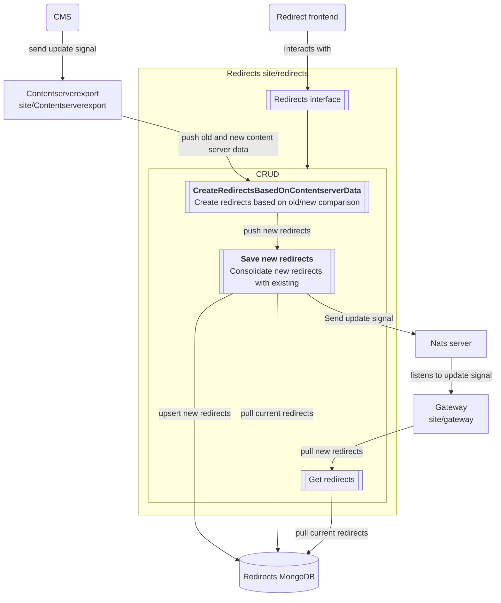

# redirects

[](https://godoc.org/github.com/foomo/go)
[](https://goreportcard.com/report/github.com/foomo/redirects)
[](https://github.com/foomo/redirects/actions/workflows/test.yml)


## Introduction and Goals

Framework to kickstart automatic redirects.

## System Scope and Context



### Service Endpoints

The redirects service provides an API that the frontend and the site-gateway services can use to manipulate redirects.

#### Internal

  ##### CreateRedirectsFromContentserverexport

  ```go
  func (rs *Service) CreateRedirectsFromContentserverexport(
    _ http.ResponseWriter,
    r *http.Request,
    old,
    new map[string]*content.RepoNode,
  ) error
  ```
  Creates redirects from contentserverexport based on old/new state comparison.

  ##### GetRedirects

  ```go
  func (rs *Service) GetRedirects(_ http.ResponseWriter, r *http.Request) (map[redirectstore.Dimension]map[redirectstore.RedirectSource]*redirectstore.RedirectDefinition, error)
  ```
  Returns all redirects.

#### Public (used by frontend)

  ##### Search

  ```go
  func (rs *Service) Search(_ http.ResponseWriter, r *http.Request, locale, path string) (map[redirectstore.RedirectSource]*redirectstore.RedirectDefinition, *redirectstore.RedirectDefinitionError)
  ```
  Search for a redirect.

  ##### Create

  ```go
  func (rs *Service) Create(_ http.ResponseWriter, r *http.Request, def *redirectstore.RedirectDefinition, locale string) (redirectstore.EntityID, *redirectstore.RedirectDefinitionError)
  ```
  Create a redirect.

  ##### Delete

  ```go
  func (rs *Service) Delete(_ http.ResponseWriter, r *http.Request, id string) *redirectstore.RedirectDefinitionError
  ```
  Delete a redirect.

  ##### Update

  ```go
  func (rs *Service) Update(_ http.ResponseWriter, r *http.Request, def *redirectstore.RedirectDefinition) *redirectstore.RedirectDefinitionError
  ```
  Update a redirect.

## Usage

```go
import (
	keelmongo "github.com/foomo/keel/persistence/mongo"
	keelservice "github.com/foomo/keel/service"
	"github.com/foomo/redirects/domain/redirectdefinition"
	redirectrepository "github.com/foomo/redirects/domain/redirectdefinition/repository"
	redirectservice "github.com/foomo/redirects/domain/redirectdefinition/service"
	redirectnats "github.com/foomo/redirects/pkg/nats"
)

persistor, err := keelmongo.New(ctx, pkgconfig.GetDefaultMongoURI(c, "database_name")())
log.Must(l, err, "could not create mongo persistor")

repo, err := redirectrepository.NewBaseRedirectsDefinitionRepository(l, persistor)
log.Must(l, err, "could not create redirect repository")

updateSignal, err := redirectnats.NewUpdateSignal(
  ctx,
  l,
  pkgconfig.GetLocalNatsServer(c)(),
  "site-redirects",
  redirectnats.DefaultNatsTopic().String(),
)
log.Must(l, err, "failed to create update signal")

api, err := redirectdefinition.NewAPI(l, repo, updateSignal, redirectdefinition.WithSiteIdentifierProvider(redirects.GetSiteIdentifierProviderFunc()))
log.Must(l, err, "could not create redirect api")

service := redirectdefinition.NewService(
  l,
  api,
  redirectdefinition.WithEnabledFunc(
    pkgconfig.GetClusterFleetBool(c, "enabled", true),
  ),
)

// add services
svr.AddServices(
  // add public site service
  keelservice.NewHTTP(l, "redirects-admin", ":8080",
    redirectservice.NewDefaultAdminServiceGoTSRPCProxy(service),
    keelgotsrpcmiddleware.Telemetry(),
    middleware.Telemetry(),
    middleware.Logger(),
    session.SessionIDMiddleware(sessionDomains(), false, pkgconfig.GetDefaultDomainProviderOptions()),
    middleware.RequestID(),
    middleware.Recover(),
  ),
  keelservice.NewHTTP(l, "redirects-internal", ":8081",
    redirectservice.NewDefaultInternalServiceGoTSRPCProxy(service),
    keelgotsrpcmiddleware.Telemetry(),
    middleware.Telemetry(),
    middleware.Logger(),
    session.SessionIDMiddleware(sessionDomains(), false, pkgconfig.GetDefaultDomainProviderOptions()),
    middleware.RequestID(),
    middleware.Recover(),
  ),
)

```

## License

Distributed under MIT License, please see license file within the code for more details.
